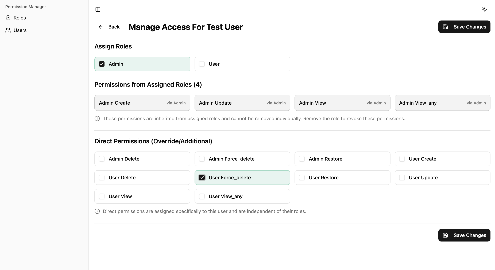
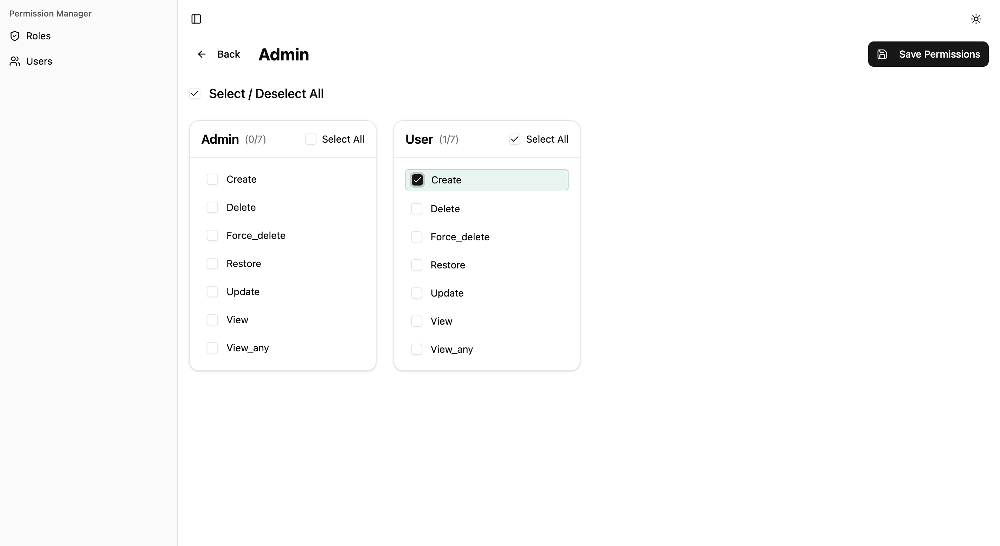

# Laravel User Permissions

A Laravel package for managing user roles and permissions. It uses PHP enums for type-safe role definitions and provides a web dashboard for managing access control. Ideally suited for applications that require a robust, easy-to-manage permission system with a visual interface.

## Table of Contents

- [Requirements](#requirements)
- [Installation](#installation)
- [Quick Start](#quick-start)
- [Configuration](#configuration)
- [Dashboard](#dashboard)
- [Working with Roles](#working-with-roles)
- [Working with Permissions](#working-with-permissions)
- [Laravel Gate Integration](#laravel-gate-integration)
- [Middleware](#middleware)
- [Model Actions](#model-actions)
- [Events](#available-events)
- [Excluding Models](#excluding-models-from-permission-generation)
- [Caching](#caching)
- [Testing](#testing)
- [Troubleshooting](#troubleshooting)
- [Similar Packages](#similar-packages)
- [Security](#security)
- [License](#license)

## Requirements

- PHP 8.4+
- Laravel 12.35.0+

## Installation

Install the package via Composer:

```bash
composer require techieni3/laravel-user-permissions
```

Run the installation command to set up the package:

```bash
php artisan install:permissions
```

This command will:
- Publish the config file to `config/permissions.php`
- Publish migrations to `database/migrations/`
- Publish `Role.php` `ModelActions.php` enums to `app/Enums`
- Add the `HasRoles` trait to your User model

Run the migrations:

```bash
php artisan migrate
```

## Quick Start

### 1. Define Your Roles

Edit `app/Enums/Role.php`:

```php
<?php

namespace App\Enums;

enum Role: string
{
    case Admin = 'admin';
    case Editor = 'editor';
    case User = 'user';
}
```

### 2. Sync Roles to Database

```bash
php artisan sync:roles
```

### 3. Generate Permissions

The package automatically generates permissions for your models based on actions defined in `app/Enums/ModelActions.php`:

```bash
php artisan sync:permissions
```

This creates permissions like `post.create`, `post.update`, `user.view_any`, etc.

### 4. Assign Roles and Permissions

```php
use App\Enums\Role;

// Assign a role
$user->addRole(Role::Admin);

// Assign permission directly
$user->addPermission('post.create');

// Check permissions
if ($user->hasPermission('post.create')) {
    // User can create posts
}

// Check roles
if ($user->hasRole(Role::Admin)) {
    // User is an admin
}
```

## Configuration

The config file is located at `config/permissions.php`:

```php
return [
    'dashboard' => [
        'enabled' => true,
        'prefix' => 'permissions-manager',
        'middleware' => ['web', 'auth'],
        'gate' => 'viewPermissionsDashboard',
        'user_display_column' => 'name',
    ],

    'models' => [
        'directory' => app_path('Models'),
        'excluded' => [
            // App\Models\User::class,
        ],
    ],

    'classes' => [
        'user' => App\Models\User::class,
        'role_enum' => App\Enums\Role::class,
        'model_actions_enum' => App\Enums\ModelActions::class,
    ],

    'events_enabled' => true,
];
```

### Dashboard Configuration

**`enabled`** - Enable or disable the web dashboard (default: `true`)

**`prefix`** - URL path for the dashboard (default: `permissions-manager`)

**`middleware`** - Middleware applied to dashboard routes (default: `['web', 'auth']`)

**`gate`** - Gate name for authorizing dashboard access (default: `viewPermissionsDashboard`). Set to `null` to disable authorization.

**`user_display_column`** - Database column to display as username in the dashboard (default: `name`)

### Model Discovery

**`directory`** - Path to scan for models when generating permissions

**`excluded`** - Array of model classes to skip during permission generation

### Core Classes

**`user`** - Your application's User model class

**`role_enum`** - The enum class defining your roles

**`model_actions_enum`** - The enum class defining permission actions

### Events

**`events_enabled`** - Enable or disable event dispatching when roles/permissions change (default: `true`)

## Dashboard

Access the dashboard at `/permissions-manager` (or your configured prefix).

### Protecting Dashboard Access

Define a gate in your `AppServiceProvider`:

```php
use Illuminate\Support\Facades\Gate;

public function boot(): void
{
    Gate::define('viewPermissionsDashboard', function (User $user) {
        return $user->hasRole('admin');
    });
}
```

To disable gate authorization, set `'gate' => null` in the config.

### Dashboard Features

- **Users Page**: List all users, search, and view their roles/permissions
- **Roles Page**: List all roles and their assigned permissions
- **User Detail**: Assign/remove roles and permissions for a specific user
- **Role Detail**: Manage which permissions are assigned to a role

### Screenshots

*Users Access Management*


*Role Permissions*


## Working with Roles

### Adding Roles

```php
use App\Enums\Role;

// Add a single role
$user->addRole(Role::Admin);

// Add multiple roles
$user->syncRoles([Role::Admin, Role::Editor]);
```

### Removing Roles

```php
// Remove a role
$user->removeRole(Role::Admin);

// Remove all roles and sync new ones
$user->syncRoles([Role::User]);
```

### Checking Roles

```php
// Check a single role
if ($user->hasRole(Role::Admin)) {
    // User is an admin
}

// Check any role
if ($user->hasAnyRole([Role::Admin, Role::Editor])) {
    // User has at least one of these roles
}

// Check all roles
if ($user->hasAllRoles([Role::Admin, Role::Editor])) {
    // User has both roles
}
```

### Query Users by Role

```php
// Get all admins
$admins = User::role(Role::Admin)->get();

// Get users with multiple roles
$editors = User::role([Role::Admin, Role::Editor])->get();

// Get users without a role
$nonAdmins = User::withoutRole(Role::Admin)->get();
```

## Working with Permissions

### Adding Permissions

```php
// Add a single permission
$user->addPermission('post.create');

// Sync multiple permissions
$user->syncPermissions(['post.create', 'post.update', 'post.delete']);
```

### Removing Permissions

```php
// Remove a permission
$user->removePermission('post.create');

// Remove all permissions and sync new ones
$user->syncPermissions(['post.view']);
```

### Checking Permissions

```php
// Check single permission
if ($user->hasPermission('post.create')) {
    // User can create posts
}

// Using alias
if ($user->hasPermissionTo('post.create')) {
    // Same as hasPermission()
}

// Check any permission
if ($user->hasAnyPermission(['post.create', 'post.update'])) {
    // User has at least one permission
}

// Check all permissions
if ($user->hasAllPermissions(['post.create', 'post.update'])) {
    // User has all permissions
}
```

### Query Users by Permission

```php
// Get users with permission
$creators = User::permission('post.create')->get();

// Get users with multiple permissions
$editors = User::permission(['post.create', 'post.update'])->get();

// Get users without permission
$viewers = User::withoutPermission('post.create')->get();
```

### Understanding Direct vs Role Permissions

Users can have permissions in two ways:

1. **Direct permissions**: Assigned directly to the user
2. **Role permissions**: Inherited from assigned roles

```php
// Get all permissions (direct + role-based)
$allPermissions = $user->getPermissions();

// Get only direct permissions
$directPermissions = $user->directPermissions;
```

## Laravel Gate Integration

All permissions are automatically registered with Laravel's authorization system:

```php
// Using Gate facade
if (Gate::allows('post.create')) {
    // Current user can create posts
}

// Using User model
if ($user->can('post.create')) {
    // User can create posts
}

// In Blade templates
@can('post.create')
    <button>Create Post</button>
@endcan
```

## Middleware

The package provides middleware for protecting routes.

### Permission Middleware

```php
// Require single permission
Route::get('/posts/create', CreatePost::class)
    ->middleware('permission:post.create');

// Require any of multiple permissions (OR)
Route::get('/posts', ViewPosts::class)
    ->middleware('permission:post.view|post.view_any');
```

### Role Middleware

```php
// Require single role
Route::get('/admin', AdminDashboard::class)
    ->middleware('role:admin');

// Require any of multiple roles (OR)
Route::get('/dashboard', Dashboard::class)
    ->middleware('role:admin|editor');
```

### Role or Permission Middleware

```php
// Require role OR permission
Route::get('/posts', ViewPosts::class)
    ->middleware('role.or.permission:admin|post.view');
```

## Model Actions

The `ModelActions` enum defines which actions to generate permissions for:

```php
<?php

namespace App\Enums;

enum ModelActions: string
{
    case ViewAny = 'view_any';
    case View = 'view';
    case Create = 'create';
    case Edit = 'update';
    case Delete = 'delete';
    case Restore = 'restore';
    case ForceDelete = 'force_delete';
}
```

You can add custom actions:

```php
enum ModelActions: string
{
    // ... existing cases
    case Publish = 'publish';
    case Archive = 'archive';
}
```

Run `php artisan sync:permissions` after modifying the enum.

## Events

The package dispatches events when roles and permissions change, allowing you to react to authorization changes in your application.

### Available Events

| Event | Triggered When | Properties |
|-------|---------------|------------|
| `RoleAdded` | A single role is added to a user | `$model`, `$role` |
| `RoleRemoved` | A single role is removed from a user | `$model`, `$role` |
| `RolesSynced` | Roles are synced (bulk operation) | `$model`, `$synced`, `$previous`, `$attached`, `$detached` |
| `PermissionAdded` | A single permission is added to a user | `$model`, `$permission` |
| `PermissionRemoved` | A single permission is removed from a user | `$model`, `$permission` |
| `PermissionsSynced` | Permissions are synced (bulk operation) | `$model`, `$synced`, `$previous`, `$attached`, `$detached` |

### Listening to Events

```php
use Techieni3\LaravelUserPermissions\Events\RoleAdded;
use Techieni3\LaravelUserPermissions\Events\RoleRemoved;
use Techieni3\LaravelUserPermissions\Events\RolesSynced;
use Techieni3\LaravelUserPermissions\Events\PermissionAdded;
use Techieni3\LaravelUserPermissions\Events\PermissionRemoved;
use Techieni3\LaravelUserPermissions\Events\PermissionsSynced;

// Listen to single role assignment
Event::listen(RoleAdded::class, function (RoleAdded $event) {
    $user = $event->model;
    $role = $event->role;
    
    Log::info("Role {$role->name->value} added to user {$user->id}");
});

// Listen to bulk role sync
Event::listen(RolesSynced::class, function (RolesSynced $event) {
    $user = $event->model;
    
    Log::info("User {$user->id} roles synced", [
        'added' => $event->attached->pluck('name.value'),
        'removed' => $event->detached->pluck('name.value'),
        'current' => $event->synced->pluck('name.value'),
    ]);
});

// Listen to permission changes
Event::listen(PermissionsSynced::class, function (PermissionsSynced $event) {
    $user = $event->model;
    
    Log::info("User {$user->id} permissions synced", [
        'added' => $event->attached->pluck('name'),
        'removed' => $event->detached->pluck('name'),
    ]);
});
```

### Event Properties

**Individual Events** (`RoleAdded`, `RoleRemoved`, `PermissionAdded`, `PermissionRemoved`):
- `$model` - The user model
- `$role` or `$permission` - The role/permission that was added or removed

**Sync Events** (`RolesSynced`, `PermissionsSynced`):
- `$model` - The user model
- `$synced` - Collection of roles/permissions after sync
- `$previous` - Collection of roles/permissions before sync
- `$attached` - Collection of roles/permissions that were added
- `$detached` - Collection of roles/permissions that were removed

### Disabling Events

Disable events by setting `events_enabled` to `false` in config or via environment variable:

```env
PERMISSIONS_EVENTS_ENABLED=false
```

## Excluding Models from Permission Generation

To prevent permissions from being generated for specific models:

```php
'models' => [
    'excluded' => [
        App\Models\User::class,
        App\Models\PersonalAccessToken::class,
    ],
],
```

## Caching

The package uses request-level caching for performance. Permissions and roles are cached during a single request and automatically cleared when changes occur.

You don't need to manually clear caches - the package handles this for you.

## Testing

Run the test suite:

```bash
composer test
```

Run static analysis:

```bash
composer analyse
```

Format code:

```bash
composer format
```

## Troubleshooting

### Dashboard 404 Not Found
If you are unable to access the dashboard at `/permissions-manager`:
1. Ensure you have run `php artisan migrate`.
2. Clear your route cache: `php artisan route:clear`.
3. Verify the `prefix` in `config/permissions.php`.

### Assets Not Loading
The dashboard uses inline styles and scripts. You do **not** need to publish assets. If the dashboard is blank:
1. Check your browser console for JavaScript errors.
2. Ensure `APP_URL` in your `.env` file is set correctly.

## Similar Packages

If this package doesn't fit your needs, check out these alternatives:

- [spatie/laravel-permission](https://github.com/spatie/laravel-permission) - The most popular Laravel permissions package with teams support and blade directives
- [JosephSilber/bouncer](https://github.com/JosephSilber/bouncer) - Flexible roles and abilities with a focus on simplicity and model-level permissions


## Security

If you discover a security issue, please email [niteen1593@gmail.com](mailto:niteen1593@gmail.com) instead of using the issue tracker.

## License

The MIT License (MIT). Please see [License](LICENSE.md) for more information.
